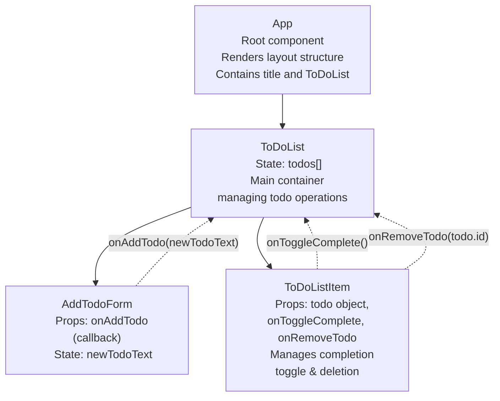

# Explanation

ToDoList: зберігає масив справ todos та керує додаванням, видаленням і відміткою виконання.

AddTodoForm: керує полем введення newTodoText і передає нову справу в ToDoList через onAddTodo.

ToDoListItem: керує локальною подією кліку для завершення справи і видалення; передає виклики до ToDoList.

App: не має стану, служить лише обгорткою і рендерить ToDoList.
